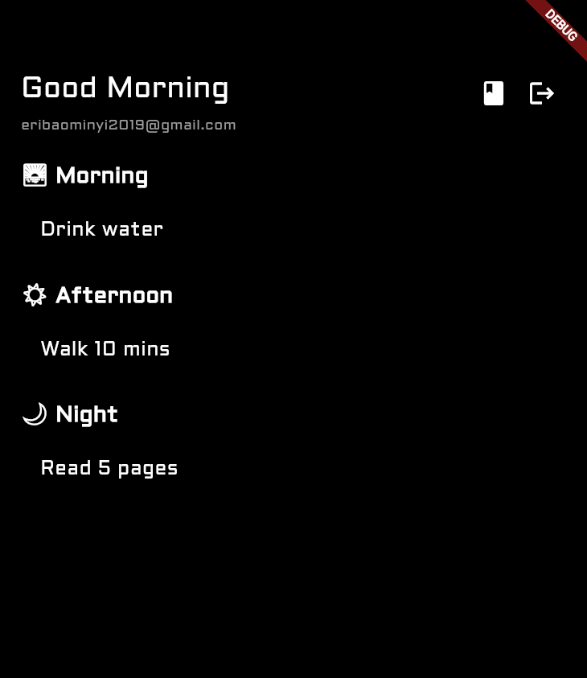

# James Jnr • Front‑End, Back-End & Flutter Developer

#### 🔹 Services & Rates
- **Landing Pages & Responsibe Websites** (HTML · CSS · JavaScript)  
  – Responsive, SEO‑friendly, basic animations/interactivity  
  – **\$150–\$200** per page

- **Bug Fix & JS Tweaks** (HTML · CSS · JavaScript)  
  – Diagnose/fix layout bugs, responsive issues, add small JS features  
  – **\$30–\$50** per hour

- **Flutter Mobile App/Prototypes** (Dart · Flutter)  
  – 10+ screens, navigation, basic state management  
  – **\$300** per project

- **Backend Integration** (Firebase/Supabase · Firestore · Auth)  
  – Real-time databases, authentication, serverless functions  
  – **$200–$300** per integration

---

#### 📂 Samples & Demos
1. **Web Frontend**  
    
3. **Flutter Prototype**  
   

> Browse the code for each demo in their respective folders.

---

#### 📬 Contact
- **Email:** juniord3mon@outlook.com  
- **GitHub:** [github.com/jaymesjnr/portfolio](https://github.com/jaymesjnr/portfolio)  
- **LinkedIn:** [linkedin.com/in/jaymesjnr](https://linkedin.com/in/jaymesjnr)

---

#### 🚀 Let’s Build Something
Whether you need a quick bug fix, a functional lwebsite, or a working mobile app/prototype, I deliver clean, maintainable code—and fast. Reach out, and let’s get it done.
